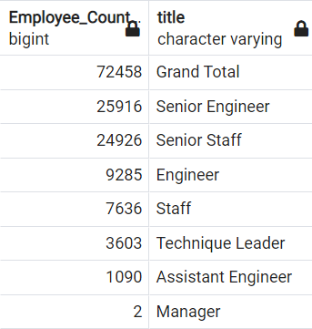
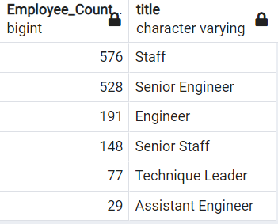

# Pewlett-Hackard Analysis

## Overview:
 
The goal of this analyis is to determine, for the fictional  **Pewlett-Hackard Company**,  how many **retiring employees** the company would have in **each job role/title**, and subsequently how many retiring employees would be available for a **mentorship program**. 

## Results:
- Pewlett-Packard faces a total of 72,458 employee retirements in the near term. This represents 30% of the existing work force (70,458/240,124).

```
Total employee count was calculated using the following query:
select count(e.emp_no) as total
from employees e
INNER JOIN titles t
	ON (e.emp_no = t.emp_no)
where t.to_date = '9999-01-01'
group by e.emp_no;
```


- The retirements are broken down by department as follows:



- 70 % of retiring employees, 50,842, are considered senior (26K senior engineers, 25K senior staff).


- We have identified 1,940 potential mentors from the retiring employee group.  The mentors are divided by current role as follows:



- The company currently lacks mentors in management roles, so may need to expand eligibility criteria for mentors to ensure all roles are covered.
- The significant number of senior employee retirements may also necessitate an expansion of the mentorship program. This is especially important if most or all of the retiring empployees will be replaced (given the limited number of trainees each mentor can support). 
